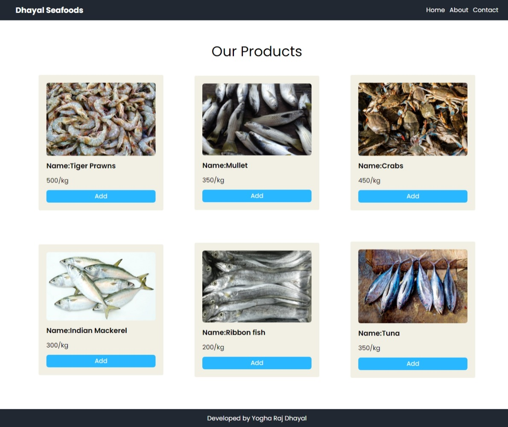

# JSON Data (JavaScript DOM Project #3)

This challenge is part of CyberDude Networks Pvt Ltd internship (Fullstack Engineer) offered by CyberDude Networks Pvt. Ltd. You can find all the source code and live links below.

### [Click here to watch site](https://yrd369.github.io/cyberdude-challenges/javascript/02-javascript-dom/03-json-data/dist/)

## Screenshot

## Tech Stack used

- [HTML](https://developer.mozilla.org/en-US/docs/Web/HTML)
- [Tailwind CSS](https://tailwindcss.com/)
- [JavaScript](https://developer.mozilla.org/en-US/docs/Web/JavaScript)

## Contribution

Feel free to `fork` this repository and `clone` it to your desktop. Once this process is done then open up the cloned repository with your IDE and run `npm install` to install the relevant dependencies to run this project.

run `npm run dev` to open up your local development server to check whether everything is working fine.

## License

[MIT License](./license.md)
