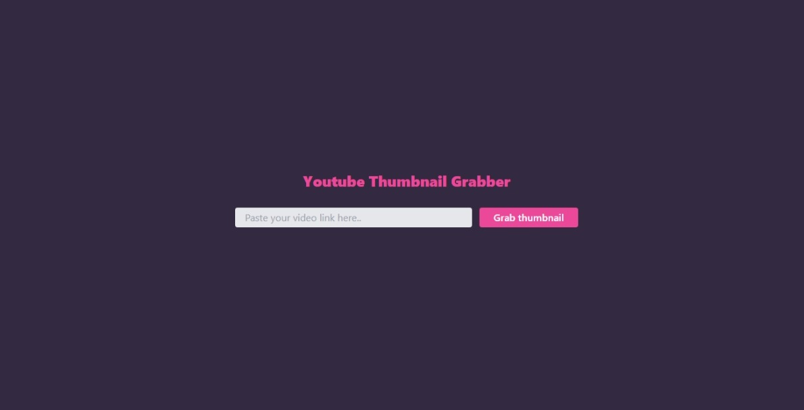

# Youtube Thumbnail Grabber
This challenge is part of free internship (Fullstack Engineer) offered by CyberDude Networks Pvt. Ltd. You can find all the source code and live links below.

## [Check this site by click here](https://yrd369.github.io/cyberdude-challenges/javascript/02-javascript-dom/05-youtube-thumbnail-grabber/dist/)

## Tech Stacks
- [HTML](https://developer.mozilla.org/en-US/docs/Web/HTML)
- [Tailwind CSS](https://tailwindcss.com/)
- [JavaScript](https://developer.mozilla.org/en-US/docs/Web/JavaScript)
- [API]()

## Screenshot


## Contribution & Installation Guide

Feel free to ```fork``` this repository and ```clone``` it to your desktop. Once this process is done then open up the cloned repository with your IDE and run ```npm install``` to install the relevant dependencies to run this project.

Run ```npm run dev``` to open up your local development server to check whether everything is working fine.

## License
[MIT License](./license.md)