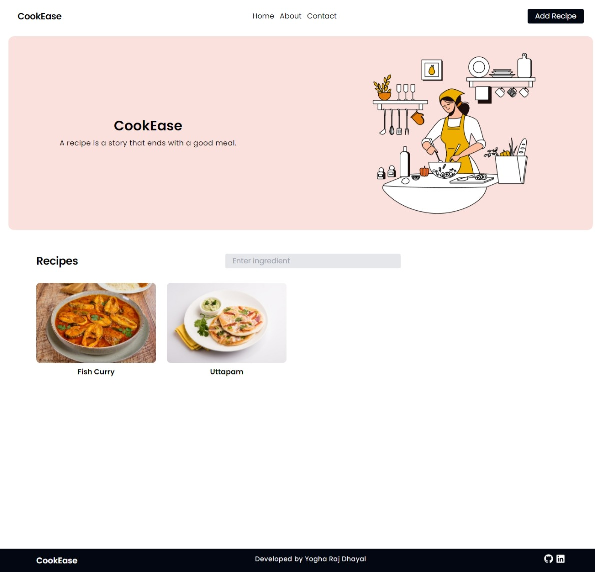
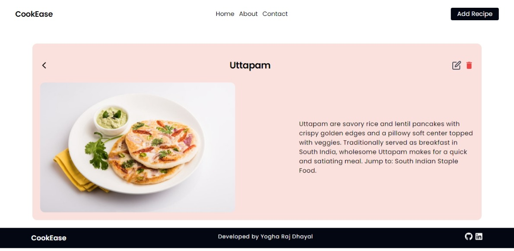
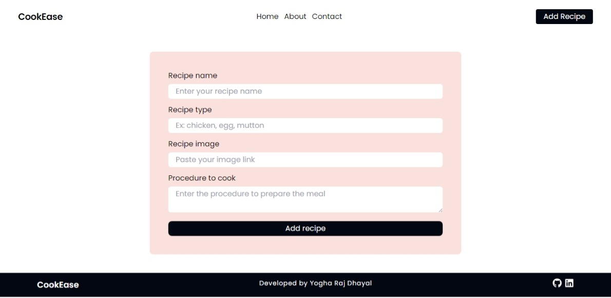

# CookEase

CookEase is an app to save your favourite recipes. It has build using CRUD operation so you can delete or edit recipes.

## Table of Contents

- [Screenshot](#Screenshot)
- [Installation](#installation)
- [License](#license)

## Screenshot

## Contribute & Installation

Feel free to fork this repository and clone it to your desktop. Once this process is done then open up the cloned repository with your IDE and run npm install to install the relevant dependencies to run this project.

run npm run dev to open up your local development server to check whether everything is working fine.

This is must that make sure to create a different branch and add all the contribution and invoke a pull request.

## License

MIT
